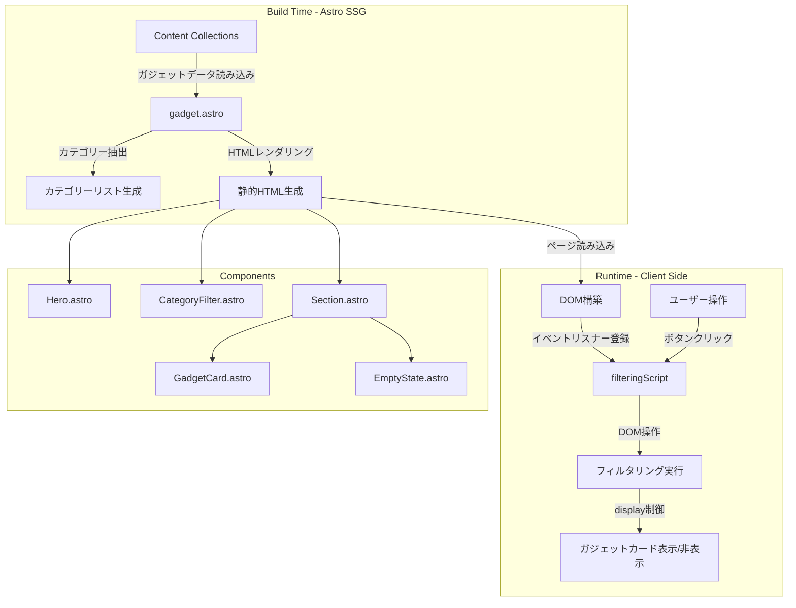
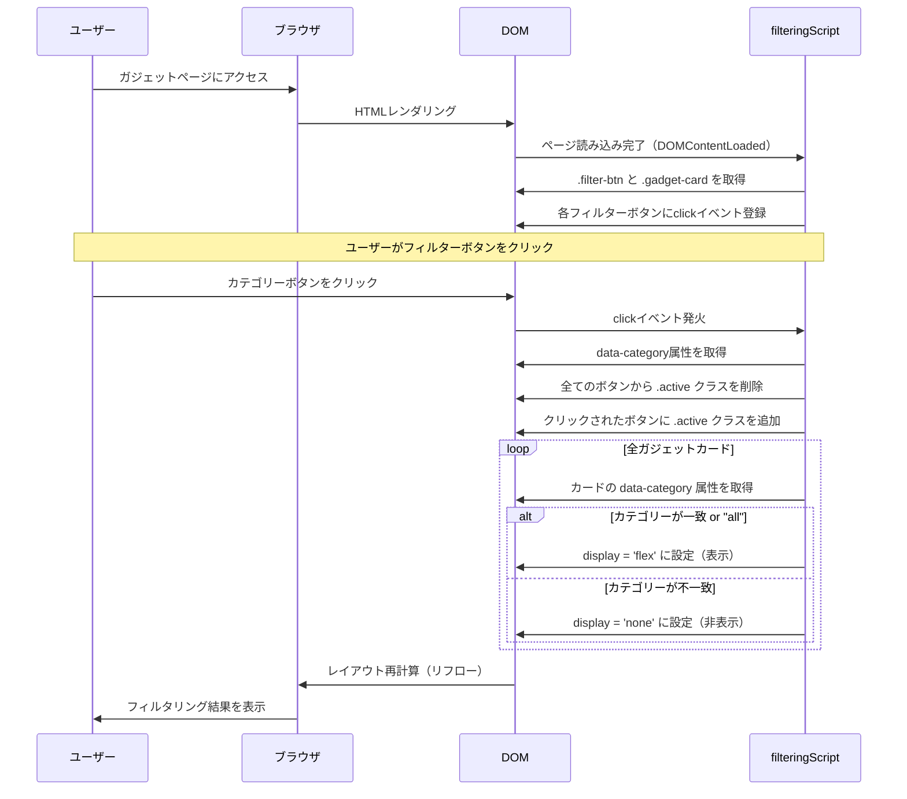
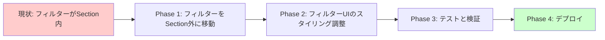

# Technical Design Document: ガジェットカテゴリーフィルタリング機能

## Overview

本設計書は、ガジェットページに既に実装されているカテゴリー別フィルタリング機能の技術設計を文書化したものです。この機能は、ユーザーがガジェットをカテゴリー別に絞り込んで閲覧できるようにするクライアントサイドのインタラクティブ機能です。

**目的**: サイト訪問者が目的のガジェットを効率的に見つけられるよう、視覚的に分かりやすいフィルターUIとスムーズな絞り込み体験を提供します。

**対象ユーザー**: ガジェットページ (`/gadget`) を訪問する全てのユーザー。特に、特定のカテゴリー（例: audio、keyboard、monitor）のガジェットを探しているユーザーが主な対象です。

**影響**: 既存のガジェットページに対する機能追加です。現在の実装では、フィルターUIがSectionコンポーネント内に配置されていますが、これは他ページ（ブログ、書籍）とのレイアウト一貫性を損なう可能性があります。

### Goals

- ユーザーが任意のカテゴリーでガジェットを絞り込めるインタラクティブなフィルター機能を提供する
- ページリロードなしにクライアントサイドで即座にフィルタリング結果を表示する
- 全ページ（ブログ、ガジェット、書籍）のコンテンツグリッドの垂直位置を揃え、認知負荷を低減する
- レスポンシブデザインに対応し、モバイルデバイスでも快適に操作できるUIを実現する

### Non-Goals

- URLパラメータとの連動（将来的な改善候補）
- 複数カテゴリーの同時選択（現在は単一カテゴリーのみ）
- 検索エンジンによるフィルター結果のインデックス（SEO対応は将来的な改善候補）
- タグベースのフィルタリング（カテゴリーフィルターのみ）

---

## Architecture

### 既存アーキテクチャ分析

くじらのTechサイトは以下のアーキテクチャパターンを採用しています：

- **Astro Static Site Generation (SSG)**: ビルド時に全HTMLを生成し、高速な静的サイト配信を実現
- **Content Collections**: ガジェットデータはMarkdown + Frontmatterで管理され、ビルド時にZodスキーマによる型安全なバリデーションを実施
- **コンポーネントベースUI**: レイアウト、コンテンツカード、UIコンポーネントを分離し、再利用性を重視
- **スコープドCSS**: Astro組み込み機能により、各コンポーネントのスタイルが自動的にスコープ化され、衝突を防止

### High-Level Architecture



### 既存アーキテクチャとの統合

**保持される既存パターン**:
- Astro Content Collectionsによるガジェットデータ管理
- BaseLayout → Hero → Section というページ構成パターン
- GadgetCardコンポーネントの`data-category`属性によるデータバインディング
- スコープドCSSによるスタイル管理

**新規コンポーネントの配置理由**:
- フィルターUIは現在Sectionコンポーネント内に配置されていますが、要件定義で明確化された「レイアウト一貫性」の原則に基づき、Sectionの外に配置することが推奨されます
- これにより、ブログページ・書籍ページと同様に、コンテンツグリッドの垂直開始位置が全ページで統一されます

**技術スタックとの整合性**:
- Vanilla JavaScriptによるクライアントサイドロジック（既存の技術スタックに準拠）
- スコープドCSSによるスタイリング（Astroの標準パターン）
- `data-*`属性によるHTMLとJavaScriptの疎結合（保守性重視）

**ステアリング原則の遵守**:
- **コンポーネント分離原則**: フィルターUIとガジェットグリッドを論理的に分離
- **レスポンシブデザイン原則**: モバイルファーストのメディアクエリ設計
- **型安全性原則**: TypeScriptによるGadget型定義の活用

---

## Technology Alignment

本機能は既存の技術スタックに完全に準拠しており、新しい外部依存関係は導入しません。

### 既存技術スタックの活用

- **Astro 5.2.5**: 静的サイト生成とコンポーネントベースUI
- **TypeScript**: 型安全なコード記述（Gadget型、any型の排除）
- **Vanilla JavaScript**: クライアントサイドロジック（追加ライブラリ不要）
- **CSS-in-Astro**: スコープドCSSによるスタイル管理
- **Content Collections**: Markdownベースのガジェットデータ管理

### 新規依存関係

**なし**: 既存の技術スタックのみで実装可能です。

---

## Key Design Decisions

### Decision 1: フィルターUIのコンポーネント化と再利用性

- **決定事項**: フィルターUIを専用の再利用可能なコンポーネント（`CategoryFilter.astro`）として分離し、Sectionコンポーネントの外に配置する
- **コンテキスト**: 現在の実装では、フィルターUIがgadget.astroページ内にハードコードされており、ブログページ・書籍ページでも同様のフィルタリング機能が将来的に必要になる可能性があります
- **検討した代替案**:
  1. **現状維持（gadget.astro内にハードコード）**: 実装は簡単だが、将来的にコードの重複が発生し、保守性が低下する
  2. **Sectionコンポーネントの外にインラインで配置**: レイアウト一貫性は保てるが、再利用性がなく、Books/Blogページでの実装時に重複コードが発生
  3. **フィルターを専用コンポーネント化**: 再利用性と保守性が最も高く、Books/Blogページでも同じコンポーネントを使用可能
- **選択したアプローチ**: フィルターを専用コンポーネント化（代替案3）
- **理由**:
  - **将来の拡張性**: Books や Blog ページでも同様のカテゴリーフィルター機能の実装が想定されるため、コンポーネントの再利用により開発効率が向上
  - **レイアウト一貫性**: Sectionコンポーネントの外に配置することで、全ページのコンテンツグリッド垂直位置を統一し、ユーザーの認知負荷を低減
  - **保守性の向上**: フィルターロジックを一箇所に集約することで、バグ修正や機能追加が容易
  - **型安全性**: ジェネリック型を活用し、異なるデータ型（Gadget, Book, BlogPost）に対応可能
- **トレードオフ**:
  - **メリット**: 再利用性、保守性、レイアウト一貫性、型安全性、将来の拡張性
  - **デメリット**: 初期実装コストがわずかに増加（コンポーネント設計とPropsインターフェースの定義）、ただし長期的には開発効率が向上

### Decision 2: クライアントサイドフィルタリング vs SSR/SSG

- **決定事項**: クライアントサイドJavaScriptによる動的フィルタリングを採用
- **コンテキスト**: 静的サイト生成（SSG）アーキテクチャにおいて、フィルタリング機能を実現する必要がある
- **検討した代替案**:
  1. **SSRでカテゴリー別ページ生成**: `/gadget/audio`, `/gadget/keyboard` などの静的ページを生成
  2. **Astro Islands + Reactコンポーネント**: よりリッチなUIフレームワークを導入
  3. **Vanilla JavaScriptによるクライアントサイドフィルタリング**: 軽量でシンプルな実装
- **選択したアプローチ**: Vanilla JavaScriptによるクライアントサイドフィルタリング（代替案3）
- **理由**:
  - ページリロードなしで即座にフィルタリング結果を表示でき、UXが向上
  - 追加のビルド時間やページ数の増加がない
  - Reactなどの重いフレームワークを導入せず、バンドルサイズを最小化
  - 既存の技術スタック（Vanilla JavaScript）に準拠し、学習コストがゼロ
- **トレードオフ**:
  - **メリット**: 即座のフィルタリング、バンドルサイズ最小、学習コストゼロ
  - **デメリット**: SEO非対応（検索エンジンはフィルター結果をインデックスできない）、URL共有不可

### Decision 3: display制御によるshow/hide実装

- **決定事項**: `display: flex` / `display: none` によるガジェットカードの表示/非表示制御
- **コンテキスト**: フィルタリング結果を視覚的にユーザーに示す必要がある
- **検討した代替案**:
  1. **DOM要素の削除/追加**: `appendChild`/`removeChild` によるDOM操作
  2. **CSS `visibility: hidden`**: レイアウトスペースを保持したまま非表示
  3. **CSS `display` プロパティ制御**: レイアウトから完全に削除
- **選択したアプローチ**: CSS `display` プロパティ制御（代替案3）
- **理由**:
  - グリッドレイアウトが自動的に再計算され、空白スペースが詰められる
  - DOM操作（追加/削除）よりもパフォーマンスが高く、リフローが最小化される
  - 実装がシンプルで、バグの混入リスクが低い
- **トレードオフ**:
  - **メリット**: パフォーマンス、シンプルさ、グリッドレイアウトの自動調整
  - **デメリット**: アニメーション効果（フェードイン/アウト）の追加が困難（将来的な改善で対応可能）

---

## System Flows

### ユーザーインタラクションフロー



### データフローとレンダリング

```mermaid
graph LR
    subgraph "Build Time"
        MD[Markdown Files] --> |frontmatter抽出| CC[Content Collections]
        CC --> |Zodバリデーション| Valid[型安全データ]
        Valid --> |getCollection| Page[gadget.astro]
        Page --> |Set抽出| Cat[カテゴリーリスト]
        Page --> |ソート| Sorted[ソート済みガジェット配列]
    end

    subgraph "Server-Side Rendering"
        Cat --> |map + レンダリング| FilterUI[フィルターボタン群]
        Sorted --> |map + レンダリング| Cards[ガジェットカード群]
        FilterUI --> HTML[静的HTML]
        Cards --> HTML
    end

    subgraph "Client-Side Runtime"
        HTML --> |querySelector| DOM[DOMノード取得]
        DOM --> |addEventListener| Events[イベント登録]
        Events --> |user interaction| Filter[フィルタリング実行]
        Filter --> |style.display制御| Display[カード表示制御]
    end
```



---

## Requirements Traceability

| 要件ID | 要件概要 | 実現コンポーネント | インターフェース | フロー図参照 |
|--------|---------|------------------|----------------|-------------|
| 1.1 | 全カテゴリーをボタンとして表示 | CategoryFilter.astro | Props.categories → フィルターボタン生成 | データフロー図 |
| 1.2 | カテゴリーリストの自動抽出 | gadget.astro | `Set` による一意抽出 → CategoryFilter.categories | データフロー図 |
| 1.3 | 「すべて」ボタンの初期アクティブ状態 | CategoryFilter.astro | Props.activeCategory (デフォルト: 'all') | - |
| 1.4 | ヒーローセクションとガジェットグリッドの間に配置 | gadget.astro | Hero → CategoryFilter → Section → gadgets-grid | - |
| 1.5 | Flexboxレイアウトと複数行折り返し | CategoryFilter.astro | CSS `.filters` スタイル | - |
| 2.1 | クリックされたボタンをアクティブ化 | CategoryFilter.astro (script) | `classList.add('active')` | インタラクションフロー図 |
| 2.2 | 以前のアクティブボタンを非アクティブ化 | CategoryFilter.astro (script) | `classList.remove('active')` | インタラクションフロー図 |
| 2.3 | 「すべて」ボタンで全カード表示 | CategoryFilter.astro (script) | `category === 'all'` 条件分岐 | インタラクションフロー図 |
| 2.4 | 特定カテゴリーのカードのみ表示 | CategoryFilter.astro (script) | `cardCategory === category` 条件分岐 | インタラクションフロー図 |
| 2.5 | 不一致カードを非表示 | CategoryFilter.astro (script) | `style.display = 'none'` | インタラクションフロー図 |
| 2.6 | クライアントサイドで即座に更新 | CategoryFilter.astro (script) | `<script>` タグによるクライアントサイド実行 | インタラクションフロー図 |
| 3.1-3.5 | フィルターボタンのビジュアルデザイン | CategoryFilter.astro | CSS `.filter-btn` スタイル | - |
| 4.1-4.4 | レスポンシブデザイン対応 | CategoryFilter.astro | メディアクエリ `@media (max-width: 768px)` | - |
| 5.1 | ガジェットカードにdata-category属性 | GadgetCard.astro | `data-category={gadget.category}` | インタラクションフロー図 |
| 5.2 | フィルターボタンにdata-category属性 | CategoryFilter.astro | `data-category={category}` | インタラクションフロー図 |
| 5.3 | data-category値の比較でフィルタリング | CategoryFilter.astro (script) | Props.targetSelector でターゲット要素取得 | インタラクションフロー図 |
| 5.4 | CSSクラスによる要素特定 | CategoryFilter.astro (script) | `.filter-btn`, Props.targetSelector | インタラクションフロー図 |
| 6.1-6.3 | 空状態とエラーハンドリング | gadget.astro | EmptyStateコンポーネント、条件分岐 | - |

---

## Components and Interfaces

### Presentation Layer

#### gadget.astro (ガジェットページコンポーネント)

**Responsibility & Boundaries**
- **Primary Responsibility**: ガジェットページ全体のレイアウトとフィルタリング機能の提供
- **Domain Boundary**: ガジェットカタログ表示ドメイン
- **Data Ownership**: ビルド時に取得したガジェットデータとカテゴリーリスト
- **Transaction Boundary**: クライアントサイドのみ（サーバーサイドトランザクションなし）

**Dependencies**
- **Inbound**: なし（トップレベルページコンポーネント）
- **Outbound**:
  - `BaseLayout.astro` - ページ全体のレイアウト構造
  - `Hero.astro` - ヒーローセクション
  - `Section.astro` - コンテンツセクションコンテナ
  - `GadgetCard.astro` - ガジェットカード表示
  - `EmptyState.astro` - 空状態表示
- **External**: Astro Content Collections API (`getCollection`)

**Contract Definition**

**Page Component Interface**:
```typescript
// gadget.astro フロントマター
interface GadgetPageData {
  pageTitle: string;
  pageDescription: string;
  gadgets: Gadget[];
  categories: string[]; // ['all', ...unique categories]
}

// getCollection から取得
type GadgetEntry = {
  data: Gadget;
  // その他のContent Collectionsプロパティ
};
```

**Client-Side Script Interface**:
```typescript
// DOM要素の取得と操作
interface FilteringScript {
  filterBtns: NodeListOf<HTMLButtonElement>;
  gadgetCards: NodeListOf<HTMLElement>;

  // イベントハンドラー
  handleFilterClick(category: string): void;
}

// data-category属性の型
type CategoryAttribute = string; // カテゴリー名 or 'all'
```

**Preconditions**:
- Content Collectionsに最低1つのガジェットデータが存在する（空配列の場合はEmptyStateを表示）
- 各ガジェットデータに`category`フィールドが必須
- GadgetCardコンポーネントが`data-category`属性をレンダリングする

**Postconditions**:
- ページ読み込み時に「すべて」ボタンがアクティブ状態
- 全てのガジェットカードが表示状態
- フィルターボタンにクリックイベントリスナーが登録済み

**Invariants**:
- 常に1つのフィルターボタンのみがアクティブ状態
- ガジェットカードの合計数は変化しない（表示/非表示のみ）

**State Management**:
- **State Model**:
  - アクティブカテゴリー（CSSクラス `.active` で管理）
  - カード表示状態（`style.display` プロパティで管理）
- **Persistence**: なし（クライアントサイド状態のみ、ページリロードでリセット）
- **Concurrency**: 単一ユーザーのみ（クライアントサイドのため競合なし）

**Integration Strategy**:
- **Modification Approach**: 既存のgadget.astroを拡張し、フィルターUIをSectionコンポーネントの外に移動
- **Backward Compatibility**: GadgetCardコンポーネントの`data-category`属性は維持
- **Migration Path**:
  1. フィルターUI部分をSectionコンポーネントの外に移動
  2. フィルターUI専用のスタイリング（max-widthやパディング）を追加
  3. 既存のクライアントサイドスクリプトは変更不要

---

#### CategoryFilter.astro (カテゴリーフィルターコンポーネント)

**Responsibility & Boundaries**
- **Primary Responsibility**: カテゴリーフィルターUIの表示とクライアントサイドフィルタリングロジックの提供
- **Domain Boundary**: カテゴリーフィルタリングUI
- **Data Ownership**: propsとして受け取ったカテゴリーリストとターゲットセレクタ
- **Transaction Boundary**: クライアントサイドのみ（UI状態管理）

**Dependencies**
- **Inbound**: `gadget.astro`, `book.astro`, `blog.astro` からのレンダリング呼び出し（将来）
- **Outbound**: なし（プレゼンテーションコンポーネント）
- **External**: ブラウザDOM API（クライアントサイドスクリプト）

**Contract Definition**

**Component Props Interface**:
```typescript
interface Props {
  categories: string[];           // カテゴリーリスト（例: ['all', 'audio', 'keyboard']）
  targetSelector: string;         // フィルタリング対象のCSSセレクタ（例: '.gadget-card'）
  activeCategory?: string;        // 初期アクティブカテゴリー（デフォルト: 'all'）
}
```

**HTML Output**:
```astro
<div class="filters-container">
  <div class="filters" id="filters">
    {categories.map((category) => (
      <button
        class={`filter-btn ${category === (activeCategory || 'all') ? 'active' : ''}`}
        data-category={category}
      >
        {category === 'all' ? 'すべて' : category}
      </button>
    ))}
  </div>
</div>
```

**Client-Side Script Interface**:
```typescript
// フィルタリングロジック
interface CategoryFilterScript {
  targetSelector: string;         // Propsから受け取ったセレクタ
  filterBtns: NodeListOf<HTMLButtonElement>;
  targetCards: NodeListOf<HTMLElement>;

  // イベントハンドラー
  handleFilterClick(category: string): void;
}
```

**Preconditions**:
- `categories` 配列に最低1つのカテゴリーが含まれる（'all'を含む）
- `targetSelector` が有効なCSSセレクタである
- フィルタリング対象の要素が `data-category` 属性を持つ

**Postconditions**:
- 初期表示時に `activeCategory` （またはデフォルト 'all'）がアクティブ状態
- 各フィルターボタンにクリックイベントリスナーが登録済み
- フィルタリング対象の要素が正しく表示/非表示制御される

**Invariants**:
- 常に1つのフィルターボタンのみがアクティブ状態
- `targetSelector` で指定された要素の合計数は変化しない

**State Management**:
- **State Model**:
  - アクティブカテゴリー（CSSクラス `.active` で管理）
  - ターゲット要素表示状態（`style.display` プロパティで管理）
- **Persistence**: なし（クライアントサイド状態のみ）
- **Concurrency**: 単一ユーザーのみ

**Reusability Strategy**:
- **ジェネリック設計**: `targetSelector` を受け取ることで、`.gadget-card`, `.book-card`, `.blog-post` など異なる要素タイプに対応
- **型非依存**: カテゴリー文字列のみを扱い、データ型（Gadget, Book, BlogPost）に依存しない
- **スタイル分離**: スコープドCSSにより、他ページのスタイルと衝突しない

**Integration Points**:
- **gadget.astro**: `<CategoryFilter categories={categories} targetSelector=".gadget-card" />`
- **book.astro (将来)**: `<CategoryFilter categories={bookCategories} targetSelector=".book-card" />`
- **blog.astro (将来)**: `<CategoryFilter categories={blogCategories} targetSelector=".blog-post" />`

---

#### GadgetCard.astro (ガジェットカードコンポーネント)

**Responsibility & Boundaries**
- **Primary Responsibility**: 個別のガジェット情報をカード形式で表示
- **Domain Boundary**: ガジェット表示UI
- **Data Ownership**: propsとして受け取ったGadgetオブジェクト
- **Transaction Boundary**: なし（プレゼンテーションコンポーネント）

**Dependencies**
- **Inbound**: `gadget.astro` からのレンダリング呼び出し
- **Outbound**: なし
- **External**: なし

**Contract Definition**

**Component Props Interface**:
```typescript
interface Props {
  gadget: Gadget;
}

// Gadget型定義（src/lib/types/gadget.ts）
type Gadget = {
  name: string;
  description: string;
  image_url?: string;
  category: string; // フィルタリングに使用
  review_url?: string;
  amazon_url?: string;
  tags: string[];
  created_at: string;
};
```

**HTML Attributes**:
- `data-category={gadget.category}` - フィルタリングスクリプトが使用
- `class="gadget-card"` - フィルタリングスクリプトが要素を特定

**Preconditions**:
- `gadget.category` が必須（undefinedやnullは許容しない）
- `gadget.name` が必須

**Postconditions**:
- `data-category`属性が正しくレンダリングされる
- `.gadget-card` クラスが付与される

---

### Client-Side Logic Layer

#### filteringScript (クライアントサイドフィルタリングロジック)

**Responsibility & Boundaries**
- **Primary Responsibility**: ユーザーのフィルター操作に応じてガジェットカードの表示/非表示を制御
- **Domain Boundary**: クライアントサイドUIインタラクション
- **Data Ownership**: DOMノードの参照とスタイル状態
- **Transaction Boundary**: 単一ユーザーセッション内のUI状態管理

**Dependencies**
- **Inbound**: ユーザーのクリックイベント
- **Outbound**: DOM API（`querySelector`, `classList`, `style`）
- **External**: ブラウザのDOM API

**Contract Definition**

**Event Handler Interface**:
```typescript
// フィルターボタンクリックハンドラー
interface FilterClickHandler {
  (event: MouseEvent): void;
}

// 処理フロー
// 1. ボタンから data-category 属性を取得
// 2. 全てのフィルターボタンから .active クラスを削除
// 3. クリックされたボタンに .active クラスを追加
// 4. 全てのガジェットカードをループ
//    - data-category が一致する or 'all' の場合: display = 'flex'
//    - 不一致の場合: display = 'none'
```

**DOM Selectors**:
```typescript
const filterBtns = document.querySelectorAll('.filter-btn');
const gadgetCards = document.querySelectorAll('.gadget-card');
```

**State Transitions**:
```
[初期状態]
  ↓ ページ読み込み
[「すべて」アクティブ, 全カード表示]
  ↓ 特定カテゴリーボタンクリック
[選択カテゴリーアクティブ, 該当カードのみ表示]
  ↓ 「すべて」ボタンクリック
[「すべて」アクティブ, 全カード表示]
```

**Preconditions**:
- DOM構築完了（scriptタグがページ末尾に配置）
- `.filter-btn` クラスを持つ要素が1つ以上存在
- `.gadget-card` クラスを持つ要素が0個以上存在

**Postconditions**:
- 選択されたカテゴリーに応じてカードの表示状態が更新される
- 正確に1つのフィルターボタンが`.active`クラスを持つ

**Invariants**:
- フィルタリング実行中も、DOMツリーの構造は変化しない（要素の追加/削除なし）
- ガジェットカードの合計数は常に一定

---

## Data Models

### Domain Model

本機能は既存のGadgetドメインモデルを活用し、新しいエンティティやバリューオブジェクトは導入しません。

**Core Concepts**:
- **Gadget (Entity)**: 個別のガジェット製品を表すエンティティ
  - Identity: `name` + `created_at` の組み合わせで一意性を保証
  - Lifecycle: Content Collectionsで管理（Markdownファイルの作成/更新/削除）
- **Category (Value Object)**: ガジェットのカテゴリーを表す文字列値
  - Immutable: カテゴリー値は変更不可
  - Validation: Zodスキーマによるビルド時バリデーション

**Business Rules & Invariants**:
- 各ガジェットは必ず1つのカテゴリーに属する（複数カテゴリーは不可）
- カテゴリーはガジェットデータから動的に抽出される（ハードコードされたリストではない）
- 「すべて」カテゴリーは特殊なメタカテゴリーであり、実際のデータとしては存在しない

### Logical Data Model

**Gadget Entity**:
```typescript
type Gadget = {
  name: string;               // 製品名（例: "AirPods Pro (第2世代)"）
  description: string;        // 説明文
  image_url?: string;         // 製品画像URL（オプション）
  category: string;           // カテゴリー名（例: "audio"）
  review_url?: string;        // レビュー記事URL（オプション）
  amazon_url?: string;        // Amazon購入リンク（オプション）
  tags: string[];             // タグ配列
  created_at: string;         // 作成日時（ISO 8601形式）
};
```

**Category List (Derived)**:
```typescript
type CategoryList = string[]; // ['all', 'audio', 'keyboard', 'monitor', ...]
```

**Relationships**:
- Gadget 1:1 Category（各ガジェットは1つのカテゴリーに属する）
- Category 1:N Gadget（各カテゴリーは複数のガジェットを持つ）

**Consistency & Integrity**:
- **Transaction Boundaries**: Content Collectionsのビルド時バリデーションにより、無効なカテゴリー値を拒否
- **Referential Integrity**: カテゴリーリストはガジェットデータから自動抽出されるため、整合性が保証される
- **Temporal Aspects**: `created_at` による作成日時の記録（更新日時は現状未対応）

### Physical Data Model

**Markdown Frontmatter (Content Collections)**:
```yaml
---
name: "AirPods Pro (第2世代)"
description: "ノイズキャンセリング機能が優秀で、集中して作業できる。音質も良好。"
image_url: ""
category: "audio"
review_url: ""
amazon_url: "https://www.amazon.co.jp/dp/XXXXXXXXXX"
tags: ["Apple", "イヤホン", "ノイキャン"]
created_at: "2024-03-10"
---
```

**Zodスキーマ定義 (src/content/config.ts)**:
```typescript
const gadgetsCollection = defineCollection({
  type: 'content',
  schema: z.object({
    name: z.string(),
    description: z.string(),
    image_url: z.string().optional(),
    category: z.string(),           // 必須フィールド
    review_url: z.string().optional(),
    amazon_url: z.string().optional(),
    tags: z.array(z.string()).default([]),
    created_at: z.string(),
  }),
});
```

**HTML Data Attributes (Runtime)**:
```html
<!-- フィルターボタン -->
<button class="filter-btn active" data-category="all">すべて</button>
<button class="filter-btn" data-category="audio">audio</button>

<!-- ガジェットカード -->
<article class="gadget-card" data-category="audio">...</article>
```

---

## Error Handling

### Error Strategy

本機能は主にクライアントサイドのUI操作であり、エラーハンドリングは最小限です。主なエラーケースは以下の通りです：

**想定されるエラーケース**:
1. **ビルド時エラー**: Content Collectionsのスキーマバリデーション失敗
2. **ランタイムエラー**: DOMノードが見つからない（スクリプト実行タイミングの問題）
3. **ユーザーエラー**: なし（UIインタラクションのみ）

### Error Categories and Responses

**ビルド時エラー（Zodバリデーション失敗）**:
- **Error Type**: ZodError
- **原因**: `category`フィールドが未定義または無効な型
- **Response**: ビルドプロセスが停止し、エラーメッセージをコンソールに出力
- **Recovery**: Markdownファイルを修正して再ビルド

```typescript
// Zodスキーマによる自動バリデーション
category: z.string() // string型必須、undefinedは拒否
```

**ランタイムエラー（DOMノード未検出）**:
- **Error Type**: TypeError (null reference)
- **原因**: スクリプトがDOM構築前に実行される
- **Response**: 現状は暗黙的にエラー発生（フィルタリング機能が動作しない）
- **Prevention**: `<script>`タグをページ末尾に配置し、DOM構築後に実行を保証

```typescript
// 現在の実装（改善の余地あり）
const filterBtns = document.querySelectorAll('.filter-btn');
const gadgetCards = document.querySelectorAll('.gadget-card');

// 推奨改善（将来的な対応）
if (filterBtns.length === 0 || gadgetCards.length === 0) {
  console.warn('Filter elements not found. Filtering functionality disabled.');
  return;
}
```

**空状態（ガジェット0件）**:
- **Error Type**: Business Logic (正常系として扱う)
- **原因**: Content Collectionsにガジェットデータが存在しない
- **Response**: EmptyStateコンポーネントを表示し、フィルターUIを非表示
- **User Guidance**: 「まだガジェットが登録されていません」メッセージ

```astro
{gadgets.length === 0 ? (
  <EmptyState message="まだガジェットが登録されていません" />
) : (
  <!-- フィルターUIとガジェットグリッド -->
)}
```

### Monitoring

本機能は静的サイトのクライアントサイド機能であるため、サーバーサイドのログやメトリクスは収集されません。以下のアプローチで品質を担保します：

**開発環境での監視**:
- ブラウザDevToolsのConsoleでJavaScriptエラーを検出
- Network Panelでページリロードの有無を確認（意図しないリロードの検出）
- Performance Panelでリフロー回数を監視（過剰なDOM操作の検出）

**ユーザーフィードバック**:
- フィルタリングが動作しない場合の報告メカニズム（将来的にGitHub Issuesなど）
- アクセス解析ツール（Google Analyticsなど）によるユーザー行動の追跡（将来的な対応）

---

## Testing Strategy

### Unit Tests

**フロントマター処理のテスト**:
1. **カテゴリーリスト抽出ロジック**: `['all', ...new Set(gadgets.map(g => g.category))]` の正確性
   - 入力: 複数のガジェットデータ（重複カテゴリーあり）
   - 期待出力: 一意のカテゴリーリスト + 'all'
2. **ガジェットソートロジック**: `created_at` 降順ソートの正確性
   - 入力: ランダムな順序のガジェット配列
   - 期待出力: 新しい順にソートされた配列

**フィルタリングロジックのテスト**:
3. **カテゴリーフィルタリング**: `category === 'all'` および `cardCategory === category` の条件分岐
   - 入力: 'all' カテゴリー選択
   - 期待動作: 全カードの `display = 'flex'`
   - 入力: 'audio' カテゴリー選択
   - 期待動作: 'audio' カードのみ `display = 'flex'`、他は `display = 'none'`
4. **アクティブ状態管理**: `.active` クラスの追加/削除
   - 期待動作: 常に1つのボタンのみが `.active` クラスを持つ

### Integration Tests

**Content Collections連携テスト**:
1. **Zodスキーマバリデーション**: 無効なガジェットデータ（`category`が未定義）を拒否
   - 入力: `category` フィールドのないMarkdownファイル
   - 期待結果: ビルドエラー（ZodError）
2. **GadgetCard連携**: `data-category`属性が正しくレンダリングされる
   - 入力: Gadgetオブジェクト（`category: 'audio'`）
   - 期待出力: `<article data-category="audio">...</article>`

**ページレンダリングテスト**:
3. **空状態の表示**: ガジェット0件の場合にEmptyStateが表示される
   - 入力: 空のガジェット配列
   - 期待出力: EmptyStateコンポーネントが表示、フィルターUIが非表示
4. **フィルターUIとグリッドの連動**: フィルターボタンクリックでグリッドが更新される
   - 操作: 'audio' ボタンをクリック
   - 期待動作: 'audio' カードのみ表示、他は非表示

### E2E/UI Tests

**ユーザーフローテスト**:
1. **ページ読み込み時の初期状態**: 「すべて」ボタンがアクティブ、全カード表示
   - 操作: ガジェットページにアクセス
   - 期待動作: `.filter-btn.active` が「すべて」ボタン、全カードが表示
2. **カテゴリーフィルタリング**: 特定カテゴリー選択で該当カードのみ表示
   - 操作: 'keyboard' ボタンをクリック
   - 期待動作: 'keyboard' カードのみ表示、グリッドレイアウトが再計算
3. **「すべて」に戻る**: 特定カテゴリーから「すべて」に戻ると全カード表示
   - 操作: 'audio' ボタンクリック → 「すべて」ボタンクリック
   - 期待動作: 全カードが再度表示される
4. **レスポンシブデザイン**: モバイルビューでフィルターボタンが適切にレイアウト
   - 操作: ビューポートを768px以下に縮小
   - 期待動作: フィルターボタンのフォントサイズとパディングが縮小
5. **レイアウト一貫性**: ブログ・書籍ページとガジェットグリッドの垂直位置が揃う
   - 操作: Blog → Gadget → Book ページ間を遷移
   - 期待動作: コンテンツグリッドの垂直開始位置が全ページで一致

### Performance Tests

本機能は静的サイトのクライアントサイド操作であり、パフォーマンステストは最小限です。

**レンダリングパフォーマンス**:
1. **フィルタリング応答速度**: ボタンクリックから表示更新までの時間
   - 目標: 100ms以内（体感的に即座）
   - 測定方法: Performance APIまたはブラウザDevTools
2. **リフロー回数**: フィルタリング実行時のレイアウト再計算回数
   - 目標: 単一リフロー（display変更のみ）
   - 測定方法: Performance Panelの「Layout」イベント数

**スケーラビリティ**:
3. **大量カード処理**: 100件のガジェットカードでのフィルタリング性能
   - 入力: 100個のガジェットデータ
   - 期待動作: フィルタリングが100ms以内に完了
4. **多数カテゴリー**: 20個のカテゴリーボタンでのレンダリング性能
   - 入力: 20個の一意カテゴリー
   - 期待動作: 初期レンダリングが500ms以内に完了

---

## Security Considerations

本機能は主にUIインタラクションであり、セキュリティリスクは限定的です。

**XSS (Cross-Site Scripting) 対策**:
- Astroのビルトインエスケープ機能により、ユーザー入力（Content Collectionsのデータ）は自動的にエスケープされます
- カテゴリー名やガジェット名に含まれる特殊文字（`<`, `>`, `&`など）は自動的にHTMLエンティティに変換されます

**Content Security Policy (CSP)**:
- インラインスクリプト（`<script>`タグ）を使用していますが、静的サイトのため外部からのスクリプトインジェクションリスクは低いです
- 将来的には、CSPヘッダーで`script-src 'self'`を設定し、インラインスクリプトを外部ファイルに分離することが推奨されます

**データ検証**:
- Zodスキーマによるビルド時バリデーションにより、無効なカテゴリー値を事前に排除
- `data-category`属性の値はビルド時に確定されるため、ランタイムでの不正な値の混入はありません

---

## Migration Strategy

既存のgadget.astroページを段階的に改善し、レイアウト一貫性を確保します。



### Phase 1: CategoryFilter.astroコンポーネントの作成とgadget.astroへの統合

**目的**: フィルターUIを再利用可能な専用コンポーネント（`CategoryFilter.astro`）として分離し、gadget.astroページに統合する

**変更内容**:

**ステップ 1.1: CategoryFilter.astroコンポーネントの作成**
```astro
---
// src/components/CategoryFilter.astro
interface Props {
  categories: string[];
  targetSelector: string;
  activeCategory?: string;
}

const { categories, targetSelector, activeCategory = 'all' } = Astro.props;
---

<div class="filters-container">
  <div class="filters" id="filters">
    {categories.map((category) => (
      <button
        class={`filter-btn ${category === activeCategory ? 'active' : ''}`}
        data-category={category}
      >
        {category === 'all' ? 'すべて' : category}
      </button>
    ))}
  </div>
</div>

<script define:vars={{ targetSelector }}>
  const filterBtns = document.querySelectorAll('.filter-btn');
  const targetCards = document.querySelectorAll(targetSelector);

  filterBtns.forEach(btn => {
    btn.addEventListener('click', () => {
      const category = btn.getAttribute('data-category');

      filterBtns.forEach(b => b.classList.remove('active'));
      btn.classList.add('active');

      targetCards.forEach(card => {
        const cardCategory = card.getAttribute('data-category');
        if (category === 'all' || cardCategory === category) {
          card.style.display = 'flex';
        } else {
          card.style.display = 'none';
        }
      });
    });
  });
</script>

<style>
  .filters-container {
    max-width: 1200px;
    margin: 0 auto;
    padding: 2rem 1.5rem 0;
  }

  .filters {
    display: flex;
    gap: 0.75rem;
    margin-bottom: 2rem;
    flex-wrap: wrap;
    justify-content: center;
  }

  .filter-btn {
    padding: 0.5rem 1.25rem;
    background-color: white;
    border: 2px solid #7dc2bb;
    color: #7dc2bb;
    border-radius: 8px;
    font-size: 0.9375rem;
    font-weight: 500;
    cursor: pointer;
    transition: all 0.2s ease;
    text-transform: capitalize;
  }

  .filter-btn:hover {
    background-color: rgba(125, 194, 187, 0.1);
  }

  .filter-btn.active {
    background-color: #7dc2bb;
    color: white;
  }

  @media (max-width: 768px) {
    .filters-container {
      padding: 1.5rem 1rem 0;
    }

    .filter-btn {
      font-size: 0.875rem;
      padding: 0.5rem 1rem;
    }
  }
</style>
```

**ステップ 1.2: gadget.astroページの更新**
```astro
<!-- 現在の構造 -->
<Section maxWidth="1200px">
  <div class="filters">...</div>
  <div class="gadgets-grid">...</div>
</Section>

<!-- 目標の構造 -->
import CategoryFilter from '../components/CategoryFilter.astro';

<Hero ... />
<CategoryFilter
  categories={categories}
  targetSelector=".gadget-card"
/>
<Section maxWidth="1200px">
  <div class="gadgets-grid">...</div>
</Section>
```

**ステップ 1.3: gadget.astroからフィルター関連コードの削除**
- `<div class="filters">...</div>` セクションを削除
- `<script>` タグのフィルタリングロジックを削除
- `.filters`, `.filter-btn` のCSSスタイルを削除

**検証ポイント**:
- `src/components/CategoryFilter.astro` が正しく作成されているか
- CategoryFilterコンポーネントがHeroセクションの直下に配置されているか
- ガジェットグリッドがSectionコンポーネント内に正しく配置されているか
- フィルタリング機能が正常に動作するか（ボタンクリックでカードが表示/非表示切り替え）
- コンソールエラーが発生していないか

### Phase 2: スタイリング調整とビジュアル検証

**目的**: CategoryFilter.astroコンポーネントのスタイルが既存のデザインと一致しているか確認し、必要に応じて微調整

**検証項目**:
1. **水平方向の配置**: フィルターUIが中央揃えで表示されているか
2. **垂直スペーシング**: HeroセクションとCategoryFilter間、CategoryFilterとSection間のスペーシングが適切か
3. **max-width**: CategoryFilterのmax-width (1200px) がSectionのmax-widthと一致しているか
4. **パディング**: デスクトップビュー (2rem 1.5rem 0) とモバイルビュー (1.5rem 1rem 0) のパディングが適切か
5. **ボタンスタイル**: カラー (#7dc2bb)、角丸 (8px)、パディング、トランジション効果が既存実装と一致しているか

**調整が必要な場合**:
CategoryFilter.astroの`<style>`セクションを編集して、以下の要素を調整：
- `.filters-container` のパディングやマージン
- `.filter-btn` のフォントサイズやスペーシング
- メディアクエリのブレークポイント

**検証ポイント**:
- ブログページ・書籍ページと比較して、コンテンツグリッドの垂直開始位置が揃っているか
- モバイルビューでフィルターボタンが適切にレイアウトされているか
- ホバー/アクティブ状態のビジュアルフィードバックが機能しているか

### Phase 3: レイアウト一貫性の検証

**目的**: ブログ・書籍ページとのコンテンツグリッドの垂直位置を確認

**検証方法**:
1. ブログページ（/blog）のコンテンツグリッド開始位置を測定
2. ガジェットページ（/gadget）のコンテンツグリッド開始位置を測定
3. 書籍ページ（/book）のコンテンツグリッド開始位置を測定
4. 3ページのY座標が一致しているか確認

**ツール**: ブラウザDevToolsの「Inspect Element」機能

**成功基準**: ±5px以内の誤差で垂直位置が一致

### Phase 4: ロールバックトリガー

**ロールバック条件**:
- フィルタリング機能が動作しなくなった場合
- レスポンシブデザインが崩れた場合
- ページレンダリングに500ms以上かかるようになった場合

**ロールバック手順**:
1. gitリポジトリから以前のコミットに戻す
2. 問題を修正してから再度デプロイ

---

以上で、ガジェットカテゴリーフィルタリング機能の技術設計書を完了します。この設計書は、既存の実装を正確に文書化し、レイアウト一貫性の改善方針を明確化しています。
